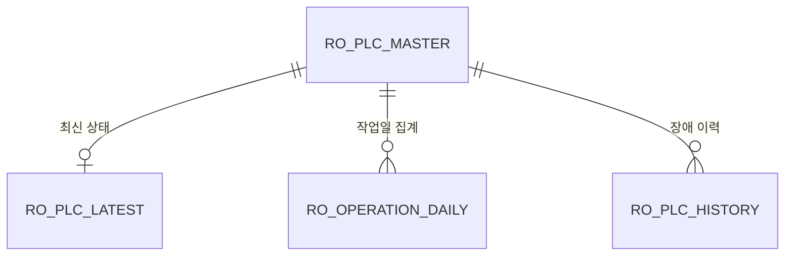

# PLC Communication Server

최대 20대 PLC의 운전 데이터를 **Modbus TCP로 약 1초 주기 수집**하고, 최신 상태와 가동률 데이터를 저장·제공하는 **C# WinForms 기반 수집 Server**입니다.

PLC별 통신을 독립적인 비동기 작업으로 처리하여 특정 PLC의 응답 지연이나 연결 실패가 다른 설비의 수집 작업으로 확산되지 않도록 구성했습니다. 모니터링 Client와 수집 Server를 분리했기 때문에 Client가 종료되더라도 PLC 데이터 수집과 데이터베이스 저장은 계속 수행됩니다.

## 해결하려는 문제

제조 현장에서는 프로그램이 실행되는 것만으로 충분하지 않습니다.

- PLC 한 대가 응답하지 않아도 다른 설비의 데이터는 계속 수집되어야 합니다.
- 화면 프로그램의 종료가 현장 데이터 수집 중단으로 이어지면 안 됩니다.
- 통신 처리와 데이터베이스 저장 속도의 차이가 수집 주기를 불안정하게 만들지 않아야 합니다.
- 장애 발생 시 어떤 PLC에서 언제 문제가 발생했는지 추적할 수 있어야 합니다.

이 프로젝트는 위 문제를 해결하기 위해 PLC 통신, 메모리 상태 관리, DB 저장, API 제공과 화면 제어의 책임을 분리했습니다.

## 주요 기능

- 최대 20대 PLC 데이터 수집
- Modbus TCP Function Code `0x03` 기반 Holding Register 조회
- 약 1초 간격의 수집 루프
- PLC별 비동기 통신과 장애 격리
- 배치당 최대 15개 PLC 병렬 처리
- 연결·읽기 타임아웃 및 실패 PLC 재시도
- 최신 상태, 시간대별 운전 시간, 일일 가동률 저장
- 메모리 기반 최신 데이터 조회
- 비동기 DB 저장 큐를 통한 수집과 저장 처리 분리
- HTTP/JSON API와 API Key 검증
- 통신 실패 이력 및 애플리케이션 로그 기록
- Model-View-Presenter(MVP) 기반 관리 화면

> 1초는 수집 루프의 목표 주기입니다. 실제 주기는 PLC 응답 시간, 네트워크 상태, 타임아웃과 등록 대수에 따라 달라질 수 있습니다.

## 전체 데이터 흐름


1. 등록된 PLC를 대상으로 Modbus TCP 요청을 수행합니다.
2. PLC별 응답을 검증하고 RUN·STOP 또는 통신 오류 상태로 변환합니다.
3. 최신 데이터는 메모리에 즉시 반영합니다.
4. 저장 작업은 별도 큐에 전달하여 백그라운드에서 데이터베이스에 기록합니다.
5. Client 요청이 들어오면 실행 상태에 따라 메모리 또는 DB의 최신 데이터를 JSON으로 반환합니다.

## 장애 격리와 수집 주기

`PlcCollectionService`는 PLC별 읽기 작업을 독립적으로 생성하고 `Task.WhenAll`로 결과를 취합합니다.

- 한 PLC에서 예외가 발생해도 해당 결과만 실패 처리합니다.
- 연속 실패한 PLC는 잠시 건너뛴 뒤 다음 주기에 다시 시도합니다.
- 전체 등록 PLC는 여러 배치로 나누며, 한 배치에서 최대 15개 통신을 병렬 실행합니다.
- 루프 수행 시간을 제외한 남은 시간만 대기하여 약 1초의 목표 주기를 유지합니다.
- 수집 루프와 가동 시간 계산 루프를 분리해 네트워크 지연이 시간 집계에 미치는 영향을 줄였습니다.

`PlcReader`는 연결, 요청 전송과 응답 수신에 각각 타임아웃을 적용하고 다음 항목을 검증합니다.

- Modbus MBAP Header
- Transaction / Protocol ID
- Unit ID
- Function Code
- 응답 Byte Count
- Register 데이터 길이

## DB 저장 구조

PLC 통신 작업이 DB 쓰기를 직접 기다리지 않도록 `DbSaveService`에 제한된 크기의 저장 큐를 두고, 별도 작업자가 순차적으로 저장합니다.

| 저장 대상 | 설명 |
|---|---|
| PLC Master | PLC 코드, 명칭, IP, Port, 사용 여부 |
| Latest | PLC별 최신 연결·운전 상태와 최종 수신 시각 |
| Operation Daily | 작업일 기준 시간대별 운전 초와 가동률 |
| History | 통신 실패 시각과 오류 내용 |

작업일은 **08:00부터 다음 날 07:59:59까지**로 계산하며, 해당 구간의 시간대별 운전 초를 기준으로 가동률을 산출합니다.

### 사용 테이블

현재 코드는 다음 테이블을 사용합니다.

- `ro_plc_master`: PLC 연결 정보와 사용 여부
- `ro_plc_latest`: PLC별 최신 운전 상태
- `ro_operation_daily`: 작업일·시간대별 운전 초
- `ro_plc_history`: PLC 통신 실패 이력



### DB 초기화

코드의 조회·저장 쿼리에 맞춘 MariaDB/MySQL 스키마가 [`database/init.sql`](database/init.sql)에 포함되어 있습니다.

```bash
mysql -u root -p < database/init.sql
```

기본 DB 이름은 `plc_monitoring`입니다. 다른 이름을 사용할 경우 SQL의 `CREATE DATABASE`·`USE` 구문과 Server 설정 화면의 DB Name을 동일하게 변경하세요.

선택적으로 비활성화된 테스트 PLC 3건을 추가할 수 있습니다.

```bash
mysql -u root -p < database/sample_data.sql
```

샘플 주소는 문서용 대역인 `192.0.2.x`를 사용하며 `use_yn='N'`으로 저장되므로 실제 통신을 시도하지 않습니다. 운영 환경에서는 실제 접속값을 공개 저장소에 커밋하지 말고 Server의 PLC 등록 화면에서 관리하세요.

## HTTP/JSON API

Server는 Client의 POST 요청을 JSON으로 역직렬화하고 API Key를 검증한 뒤 결과를 반환합니다.

| 메시지 | 용도 |
|---|---|
| `PING` | Server와 수집 상태 확인 |
| `PING_RESPONSE` | Server 상태 응답 |
| `PLC_DATA_LIST` | 최신 PLC 데이터 목록 요청 |
| `PLC_DATA_LIST_RESPONSE` | PLC 상태·가동 데이터 응답 |
| `ERROR` | 인증, 요청 형식 또는 Server 처리 오류 응답 |

수집이 실행 중이면 메모리의 최신 상태를 사용하고, 수집이 중지된 경우에는 DB에 저장된 최신 데이터를 조회합니다.

## 애플리케이션 구조

```text
View
 └─ Presenter
     └─ ServerMainService
         ├─ ApiServer / ApiHandler
         ├─ PlcCollectionService
         │   ├─ PlcReader
         │   ├─ PlcDataStore
         │   └─ RunRateService
         ├─ DbSaveService
         └─ PlcDb
```

| 구성 요소 | 역할 |
|---|---|
| View | 관리 화면 표시와 사용자 입력 처리 |
| Presenter | 화면 상태와 명령 흐름 제어 |
| ServerMainService | API, 수집, 설정 기능 조정 |
| PlcCollectionService | 다중 PLC 수집 주기와 오류 격리 |
| PlcReader | Modbus TCP 요청·응답 및 데이터 해석 |
| PlcDataStore | 메모리의 최신 PLC 상태 관리 |
| RunRateService | 시간대별 운전 초와 가동률 계산 |
| DbSaveService | 저장 큐와 백그라운드 DB 쓰기 |
| PlcDb | MariaDB/MySQL 조회와 저장 |
| ApiServer / ApiHandler | HTTP 수신, 인증, JSON 응답 |

## 실행 화면

실제 실행 화면은 공개 가능한 샘플 데이터로 캡처해 추가합니다. 현재 저장소에는 원본 캡처가 없어 임의로 만든 이미지는 사용하지 않았습니다.

Server 메인, PLC 등록, 장애 격리 로그와 설정 화면의 파일명 및 마스킹 기준은 [실행 화면 캡처 가이드](docs/screenshots/README.md)에 정리되어 있습니다. 특히 PLC 한 대를 의도적으로 연결 실패 상태로 둔 뒤 다른 PLC 수집과 DB 저장이 계속되는 로그를 함께 보여주면 장애 격리 설계를 명확하게 전달할 수 있습니다.

## 기술 스택

- C#
- .NET Framework 4.8
- Windows Forms
- Modbus TCP
- HTTP / JSON
- MariaDB / MySQL
- MySqlConnector 2.6.1
- Task-based Asynchronous Pattern
- Model-View-Presenter(MVP)

## 실행 방법

### 요구 사항

- Windows 10/11
- Visual Studio 2019 이상
- .NET Framework 4.8 Developer Pack
- MariaDB 또는 MySQL
- Modbus TCP 통신이 가능한 PLC 또는 테스트 장비
- 동일 네트워크에서 접근 가능한 PLC IP와 Port

### 실행 순서

1. 저장소를 복제합니다.

```bash
git clone https://github.com/Centumjoonho/PLC_Communication_Server.git
```

2. Visual Studio에서 `RO_Server_Rebuild_2.sln`을 엽니다.
3. NuGet 패키지를 복원하고 프로젝트를 빌드합니다.
4. DB를 준비하고 Server 설정 화면에 접속 정보를 입력합니다.
5. API Port와 API Key를 설정합니다.
6. PLC 코드, 명칭, IP, Port와 사용 여부를 등록합니다.
7. API Server를 시작한 뒤 PLC 수집을 시작합니다.
8. 로그와 PLC 상태 화면에서 연결 및 저장 결과를 확인합니다.

> API 또는 수집이 실행 중일 때는 관련 설정 변경과 PLC 정보 수정을 피하세요. 설정을 변경하려면 먼저 해당 기능을 중지한 뒤 다시 시작하는 것이 안전합니다.

## Client 연동

모니터링 화면은 아래 저장소에서 확인할 수 있습니다.

- [PLC Communication Client](https://github.com/Centumjoonho/PLC_Communication_Client)

Client의 Server IP, API Port, 요청 주기와 API Key를 이 Server의 설정과 일치시켜야 합니다.

## 보안 및 운영 시 주의사항

- API Key, DB 계정, 실제 PLC IP와 현장 설비명은 소스 코드 또는 공개 문서에 커밋하지 마세요.
- 공개 저장소의 기존 기본값은 운영용 비밀값으로 사용하지 말고 반드시 폐기·교체하세요.
- 외부망에서 사용할 경우 HTTPS, 방화벽, IP 허용 목록, API Key 회전과 요청 제한을 추가하세요.
- 운영 배포 전 장시간 통신 실패, DB 중단, Server 재시작과 네트워크 단절 시나리오를 별도로 검증하세요.
- 로그에 인증 정보나 생산 데이터가 기록되지 않도록 점검하세요.

## 향후 개선 항목

- DB 스키마 변경 이력과 마이그레이션 버전 관리
- API Key를 환경 변수 또는 암호화된 설정 저장소로 분리
- 단위 테스트와 PLC Simulator 기반 통합 테스트 추가
- 재시도 간격의 지수 백오프 적용
- 수집 지연, 실패율, DB 저장 큐에 대한 운영 지표 제공

## 라이선스

별도 라이선스가 명시되어 있지 않습니다. 사용 또는 배포가 필요한 경우 저장소 소유자에게 문의하세요.
